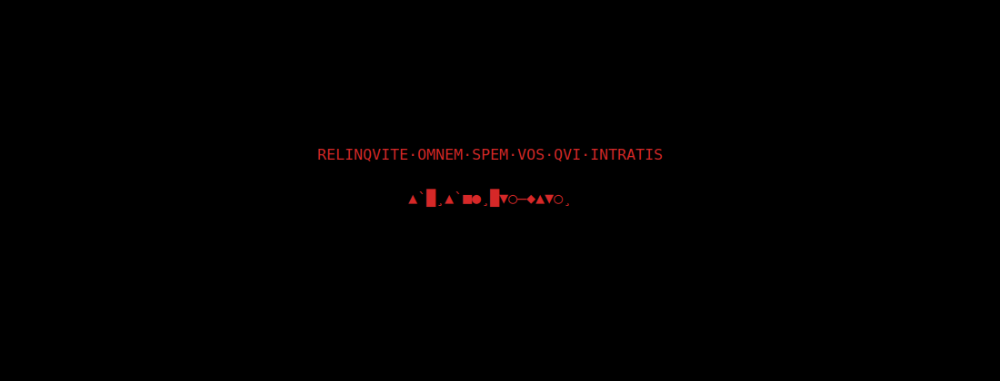

# lasciate

*Designed by a human. Implemented by an LLM.*

Rewrites what [xsecurelock](https://github.com/google/xsecurelock)'s auth
dialog says. One line of text, your words, and keystroke feedback as symbols
instead of a hex clock.




All three are files you can copy and edit; see [Themes](#themes).

## Install

Needs `xsecurelock`, a C compiler, and `libdl`. No X or Xft headers required.

```sh
git clone https://github.com/you/lasciate
cd lasciate
make
make install          # into ~/.local, no root
```

Then point your locker at `lasciate` instead of `xsecurelock`:

```sh
xss-lock --transfer-sleep-lock -- lasciate
```

and whatever your window manager uses to lock by hand — for i3:

```
bindsym $mod+l exec --no-startup-id lasciate
```

It works unconfigured, showing the inscription above; `LASCIATE_THEME` picks a
different one.

`make PREFIX=/usr/local install` for a system-wide install.

## Themes

A theme is a file — text, glyphs and colours in one place. These ship with
lasciate:

| | |
|---|---|
| `inferno` | the inscription in red on black, geometric glyphs |
| `matrix` | `Wake up, Neo...` in phosphor green, half-width katakana and digits |
| `moria` | `Pedo mellon a minno` in ithildin cyan, the elder futhark for feedback |

`inferno` is what you get with nothing set at all. To use a different one:

```sh
LASCIATE_THEME=moria lasciate
```

A theme is a shell fragment — plain assignments, sourced by the wrapper — so
writing one means copying one and editing it:

```sh
mkdir -p ~/.config/lasciate/themes
cp ~/.local/share/lasciate/themes/inferno ~/.config/lasciate/themes/inferno
```

That copy is now used instead of the one that shipped — a name is looked for in
`~/.config/lasciate/themes` first, then in `~/.local/share/lasciate/themes`.
A value with a `/` in it is a path, read from wherever it points, so a theme
need not be installed anywhere to be tried.

A name with no file behind it is reported on stderr and `inferno` is read
instead, so a typo costs the look and not the lock. `LASCIATE_SHIM` and
`LASCIATE_PROCESSING_SRC` are outside a theme — a path to a file, and a literal
inside xsecurelock that a future release may reword — as are the
`XSECURELOCK_*` variables that say how the locker behaves rather than how it
looks.

### Checking a theme

A theme names the face that draws it, because the glyphs it wants are not in
every font: `matrix` asks for `monospace:lang=ja`, since plain `monospace`
resolves on most systems to a Latin face with no katakana; `moria` asks for
`FreeMono`, which carries both the Latin of its prompt and the Runic of its
glyphs and draws every rune at one advance.

`make check` reports whether a theme will draw on this machine — today that
means whether the face it asks for has every glyph it uses, and if it does not,
which faces here do. It reads the theme file for both — the font from
`XSECURELOCK_FONT`, the glyphs from
`LASCIATE_BASES` and `LASCIATE_MARKS` — so it works for a theme you wrote, by
name or by path, and can only ever test the glyphs the theme actually draws:

```sh
make check                              # the default theme
make check THEME=moria
make check THEME=mine                   # yours, from ~/.config/lasciate/themes
make check THEME=/tmp/draft             # or from anywhere
make check THEME=matrix FONT='Some Family'   # try a face before adopting it
```

A name is looked for in `themes/` first here, then the two installed
directories — the reverse of what the wrapper does at lock time, because under
`make` the copy you are editing is the one you mean.

```
'Courier' resolves to: Courier
checking it covers the moria glyph set:
  U+16A0 MISSING -- Courier does not have it
  ...
faces on this machine that cover the whole set:
  Cardo                                  proportional
  FreeMono                               equal advances
  Junicode                               proportional
put one in XSECURELOCK_FONT, or try it first with
  make check THEME=moria FONT='<family>'
```

The `equal advances` / `proportional` tag is the part worth reading. `auth_x11`
clears only the area it is about to draw, so if a run of feedback glyphs is
narrower than the one before it, the previous run's ends stay on screen — once
per keystroke. A face with equal advances cannot do that; a proportional one
can, unless the glyphs you draw from happen to advance alike.

## The variables

These are what a theme is made of. The wrapper carries no defaults of its own:
what you see with nothing set comes out of `themes/inferno`, and what a theme
leaves alone, the shim answers for. The **From** column says where the value on
a stock install comes from.

| Variable | From | |
|---|---|---|
| `LASCIATE_THEME` | unset | a theme's name, or a path to one; `inferno` if unset |
| `LASCIATE_PROMPT` | theme | the one line of text; set it *empty* for the hostname |
| `LASCIATE_PROMPT_FAILED` | theme | shown instead, once an attempt has failed |
| `LASCIATE_PROCESSING` | theme | shown while PAM decides |
| `LASCIATE_BASES` | theme | glyphs the keystroke feedback is drawn from |
| `LASCIATE_MARKS` | theme | marks drawn after a glyph, each taking its own cell; a space means none |
| `LASCIATE_GLYPHS` | theme | how many glyphs to draw |
| `LASCIATE_NO_GLYPHS` | unset | set to leave the feedback as xsecurelock rendered it |
| `LASCIATE_PROCESSING_SRC` | shim | the string `LASCIATE_PROCESSING` replaces; change only if xsecurelock rewords it |
| `LASCIATE_SHIM` | next to the wrapper | path to `shim.so`, if it is somewhere unusual |

`LASCIATE_MARKS` and `LASCIATE_BASES` are plain UTF-8 strings, one character
per option.

The five `XSECURELOCK_*` variables a theme sets are `FONT`, `PASSWORD_PROMPT`
and the three colours. The wrapper fills in the ones left unset. See
`xsecurelock(1)`.

## When something goes wrong, it still locks

The wrapper treats everything it does as cosmetic and the lock as the only
thing that matters. Anything that ends it early is caught by an `EXIT` trap
that drops `LD_PRELOAD` and execs a plain `xsecurelock`, rather than leaving a
lit desktop. The trap's body is written out inline rather than kept in a
function, because the theme is sourced into the same shell and a function can
be redefined from there.

Two things are outside it. `exec` in a theme replaces the process outright,
taking the trap with it — so do not put one there. And `INT`, `TERM` and `HUP`
are deliberately *not* trapped: a signal means something asked this process to
stop, and `xss-lock` kills the locker to force an unlock, so locking in
response would turn a cancelled lock into a lock.

A theme is code: it is sourced into the wrapper, which is why the directories
it is read from — `~/.config/lasciate/themes` and
`~/.local/share/lasciate/themes` — should be yours alone. Nothing checks that
for you.

`LD_PRELOAD` is quarantined — taken out of the environment while the
wrapper runs, put back only on the last line — and what it will become is
loaded into `/bin/true` first. A missing or malformed object was always
harmless, since `ld.so` ignores it, but a *valid* one whose symbols will not
resolve, most often a build copied to a machine with an older glibc, aborts
every process that inherits the variable, which is a screen that silently
never locks. If the probe fails the shim is left out and an ordinary
`xsecurelock` locks the machine.

**Do not point `LASCIATE_SHIM` at a file other people can write.** Nothing
checks that for you; `make install` puts `shim.so` in 644 and that is the whole
of the arrangement. Two things are refused: a named pipe, which would block the
loader for as long as nobody opens the other end, and a path containing a space
or a colon, which `ld.so` splits and would silently load nothing.

Four limits, because a defence described as more than it is does more harm than
one that is absent:

- **Lazy binding is invisible to the probe.** `make` links the shim with
  `-z now`, so a shipped build resolves everything up front and the probe is
  conclusive for it. A hand-built `cc -shared` does not, and such a shim can
  pass and still kill `auth_x11` at the first keystroke.
- **An `LD_PRELOAD` inherited at launch is beyond reach.** If it cannot load,
  the wrapper's own `/bin/sh` dies before its first line — as does every other
  command in that session. Only a value the config sets can be caught.
- **`exec` in a theme, and `readonly` on `LD_PRELOAD` combined with an
  unloadable object, both defeat the failsafe.** Each requires writing a theme
  file, which is code you run as yourself.

On distributions where `/bin/sh` is bash — Arch, Fedora, RHEL, openSUSE — the
wrapper turns on POSIX mode for itself. Bash otherwise looks up functions
before special builtins, which would let a theme define `exec` or `unset` as a
function and take the failsafe with it; in POSIX mode those names are not legal
function names at all, and such a config is a parse error rather than a hijack.
dash, Debian and Ubuntu's `/bin/sh`, already behaves that way.

If `xsecurelock` itself is missing there is nothing left to fall back to, and
that is said on stderr, in the journal, and on screen, with a non-zero exit so
whatever called the wrapper records it too.

## Why this is a preload and not a config file

xsecurelock has no setting for the text in its auth dialog, and there is no way
to add one without patching a binary. Two things you might reach for first do
not work:

**The prompt is not xsecurelock's string.** `auth_x11` contains no such
literal. It draws `<hostname>` + `" - "` + `<prompt>`, where the separator is
compiled in and the prompt arrives from libpam.

**A gettext catalogue does not reach it either.** `authproto_pam` calls
`setlocale(LC_CTYPE, "")` and nothing else, so `LC_MESSAGES` stays `"C"` — and
under a C locale glibc's gettext returns every msgid untranslated, whatever
`LANGUAGE` or `LC_ALL` say. An installed `Linux-PAM.mo` is never consulted.

What does work is intercepting `dcgettext`, which libpam imports and
`authproto_pam` does not, so the call originates inside libpam and a preloaded
definition wins. Substituting there also sidesteps the C locale entirely.
Strings that belong to `auth_x11` rather than libpam — the status message, the
keystroke feedback — are caught in the drawing hook instead, which sees
everything regardless of origin.

Four functions are intercepted. Three are display-only:

| | |
|---|---|
| `dcgettext` | the password prompt |
| `XftTextExtentsUtf8` | how `auth_x11` measures text |
| `XftDrawStringUtf8` | how `auth_x11` draws it |

The fourth is `pam_authenticate`, wrapped for the tamper trace below. It is an
observer and not a filter: it calls the real function, notes that the result was
non-zero, and hands that result back unaltered. No path through it can turn a
failed unlock into a successful one, it never sees the password, and if the real
symbol cannot be resolved it returns non-zero — failing closed, never inventing
`PAM_SUCCESS`.

Nothing alters the PAM conversation, the authentication decision, or the
password. Nothing is patched or copied — no private build of an auth library to
go stale when libpam is upgraded — and `LD_PRELOAD` is set only by the wrapper,
so `sudo`, `su` and `login` are untouched.

## Is the feedback still secure?

`XSECURELOCK_PASSWORD_PROMPT=time_hex` shows the clock in hex on each
keystroke. Its author's argument is that this is the most secure feedback
available: derived exclusively from public information, carrying no state
between keystrokes, *not even randomness*.

The symbols preserve that. They are a hash of the `time_hex` string and of
nothing else — public information in, public information out. The output is a
fixed number of glyphs whatever the input, so unlike asterisks it cannot hint
at how much has been typed.

What still leaks, here as in every mode except `hidden`, is that a keystroke
happened at all. Any visible feedback does that.

## Tamper trace

A failed unlock replaces the line for the rest of the lock:

```
                  TEMPTATVM·EST
```

Coming back to changed text means somebody tried while you were away. The error
message alone cannot tell you that — it is long gone by the time you return.

The flag is a file under `XDG_RUNTIME_DIR` (tmpfs, mode 700, gone at reboot),
removed by the wrapper when the lock *starts*, so each session begins clean and
what you see always refers to the lock in front of you. It cannot live in the
process: `auth_x11` is spawned per attempt and exits again.

Failures are detected from `pam_authenticate`'s return value. Nothing on screen
can serve instead: `auth_x11` has no failure text of its own beyond a generic
`Error`, and `authproto_pam`'s protocol with it is single-character message
types. The hook is an observer — it calls the real function, notes a non-zero
result, and returns that result unaltered.

## Notes

**Both Xft calls must be hooked.** `auth_x11` clears only the area it is about
to draw, sized from the extents call. Rewrite one and not the other and the
text lands off-centre with the previous line surviving around it. The same
mechanism is why the status message is padded to the prompt's width — stock
xsecurelock never shows this, because `Processing...` happens to be wider than
`Password: `.

**Combining marks do not combine.** `auth_x11` links no shaping engine — no
HarfBuzz, no Pango — so a mark is not placed over the glyph before it. It takes
a cell of its own: a base plus a grave measures exactly as wide as two bases.
`LASCIATE_MARKS` therefore draws spacing marks, and a run carrying a variable
number of them is a run of variable width, which smears. The themes here set
it to a single space, meaning none.

**Check your font.** A theme's glyphs assume one face covers all of them; a
glyph that falls back arrives at a different width and breaks the run. See
[Checking a theme](#checking-a-theme).

**Version coupling.** `Processing...` is `auth_x11`'s literal as of xsecurelock
1.9.0. If a future release rewords it, set `LASCIATE_PROCESSING_SRC` to match.
The libpam side (`"Password: "`, domain `Linux-PAM`) is far more stable.

## Testing

```sh
make test
```

Covers everything that does not need an X server: which strings get rewritten,
that the substitution is deterministic, that the status is padded to the
prompt's width, that the glyph count is fixed, and — against a stand-in
xsecurelock — that the wrapper still locks when a theme file misbehaves, and
says so out loud when it cannot lock at all.

The one thing it cannot check is where marks physically land, which needs a
real X server and a real font. **Test your first lock with a way back in** — a
spare VT on `Ctrl+Alt+F3`, or an SSH session — as you would with any change to
a lock screen.

## License

Apache 2.0. See `LICENSE` and `NOTICE`.

Free for anyone to use, for anything, at no cost. Redistributions must keep the
attribution in `NOTICE`.
